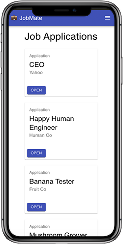

# JobMate.work 💼 (backend)

**Track your job applications from submission to landing your dream job! [Try here.](https://app.workmate.work)**

### What is this?

JobMate is a job application tracker.

Eventually, this will be a complete application workflow allowing you to manage your job applications, track key actions (interviews, rejections emails, etc), and generate reports based on responses (e.g 50% of applications from X month lead to an interview).

_Looking for the frontend code? [It's over here](https://github.com/joshamore/applicationtracker)_.

#### Current features:

- ✅ You can register a new account.
- ✅ You can log in.
- ✅ You can log out.
- ✅ You can add a job application (job title, company, and a link to the job posting).
- ✅ You can update a job application.
- ✅ You can add a job application item (e.g a note with information about the job application).
- ✅ You can view all added job applications.

#### Features in progess:

- 🏗️ You can delete a job application.
- 🏗️ You can delete a job application item.
- 🏗️ You can change the date of a job application.
- 🏗️ You can set the status of a job application (e.g submitted, interview, rejection, etc).

#### Future feature roadmap:

- 🏎️ You can generate a report to find the number of applications submitted, rejected, etc in a specific period.
- 🏎️ You can add, edit, and delete contacts from a job application.
